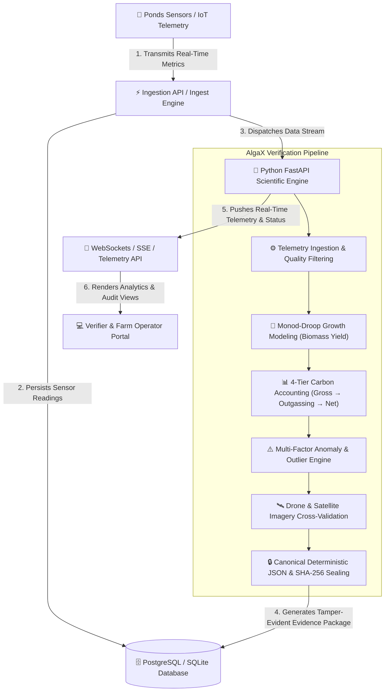

# AlgaX — Carbon Intelligence & Verification Platform
### Verification Framework & Carbon Accounting Engine | AlgaX Technologies

AlgaX is a production-grade, real-time carbon intelligence and verification platform designed specifically for microalgae-based carbon sequestration farms. Built in accordance with international MRV (Measurement, Reporting, and Verification) carbon credit standards, AlgaX combines high-frequency sensor telemetry, biological Monod-Droop growth modeling, multi-factor anomaly detection, imagery cross-validation, and SHA-256 cryptographic evidence sealing.

---

## 🏗️ System Architecture

AlgaX is built on a decoupled, micro-service architecture engineered for high-throughput sensor telemetry ingestion, scientific growth engine calculations, multi-factor anomaly detection, and tamper-evident evidence verification.



### Tech Stack Breakdown
* **Frontend:** React 18 • Next.js 14 (App Router) • Vanilla CSS / Tailwind CSS • Recharts (Telemetry Analytics & Carbon Waterfalls) • Lucide Icons
* **Backend:** Python (FastAPI) • PostgreSQL / SQLite3 (Async SQLAlchemy & Alembic) • Pydantic v2 • Authoritative Role-Based Access Control (`FARM_OPERATOR`, `VERIFIER_AUDITOR`, `PLATFORM_ADMIN`)
* **Scientific & Verification Engine:** Python 3.10+ • Monod-Droop Kinetics Engine • NumPy & SciPy • ReportLab (Audit Certificate PDF Generator) • Cryptographic SHA-256 Canonical Serializer

---

## 👥 Role & Access Structure

AlgaX implements strict backend-enforced authorization across three primary roles:

### 1. Farm Operator (`FARM_OPERATOR`)
The Farm Operator is responsible for day-to-day operation, monitoring, and evidence preparation for assigned facilities:
* **Scope & Permissions:** Scoped to assigned farms and raceway ponds.
* **Capabilities:** Monitor live sensor telemetry, inspect drone/satellite imagery, investigate biological anomalies, run Monod-Droop simulations, record harvest events, log sensor calibration records, and generate/prepare Evidence Packages.
* **Boundaries:** Cannot modify platform user accounts, cannot alter system-wide settings, and cannot issue official verifier audit decisions.

### 2. Verifier / Auditor (`VERIFIER_AUDITOR`)
The Verifier / Auditor is an independent human auditor reviewing empirical evidence produced by AlgaX:
* **Scope & Permissions:** Access to evidence packages, cross-validation runs, audit logs, and provenance records for authorized facilities.
* **Capabilities:** Open and inspect sealed evidence packages, verify SHA-256 cryptographic hashes, review carbon calculation waterfalls, evaluate imagery cross-validation consistency, record audit review notes, and mark evidence packages as ready for external registry submission.
* **Boundaries:** Cannot alter raw telemetry sensor readings, cannot modify scientific model equations, cannot tamper with finalized evidence packages, and cannot administer platform accounts. *(Note: The role represents a human auditor using AlgaX; AlgaX itself does not claim independent third-party certification).*

### 3. Platform Admin (`PLATFORM_ADMIN`)
The Platform Admin is the highest-privilege platform management role:
* **Scope & Permissions:** Unscoped platform-wide access.
* **Capabilities:** Create, edit, and deactivate user accounts; assign roles (`FARM_OPERATOR`, `VERIFIER_AUDITOR`, `PLATFORM_ADMIN`); assign users to facilities; configure registry integrations; inspect platform audit logs; monitor system health.
* **Boundaries:** All administrative operations are fully audited and adhere to standard security boundaries.

---

## 🗄️ Database Schema

The database model is implemented in PostgreSQL/SQLite to support relational carbon accounting with strict data integrity guarantees.

### 1. `users`
Stores registered platform operators, verifiers/auditors, and administrators.
| Column | Type | Constraints | Description |
|--------|------|-------------|-------------|
| `id` | TEXT | PRIMARY KEY | Unique UUID identifier |
| `email` | TEXT | UNIQUE | User login email |
| `name` | TEXT | - | Full name of the user |
| `role` | TEXT | CHECK (In roles) | `FARM_OPERATOR`, `VERIFIER_AUDITOR`, `PLATFORM_ADMIN` |
| `assigned_farm_id` | TEXT | FOREIGN KEY | References `farm(id)` for farm-level isolation |
| `is_active` | INTEGER | DEFAULT 1 | Account status flag |
| `created_at` | TEXT | DEFAULT CURRENT_TIMESTAMP | Registration timestamp |

### 2. `farms`
Stores algae cultivation farm facilities and geographic locations.
| Column | Type | Constraints | Description |
|--------|------|-------------|-------------|
| `id` | TEXT | PRIMARY KEY | Unique farm identifier |
| `name` | TEXT | - | Name of the facility |
| `location` | TEXT | - | Geographical region / address |
| `latitude` | REAL | - | Latitude coordinate |
| `longitude` | REAL | - | Longitude coordinate |
| `total_area_m2` | REAL | - | Total cultivation surface area in $m^2$ |
| `algae_species` | TEXT | - | Dominant strain (e.g., *Chlorella vulgaris*, *Spirulina*) |
| `created_at` | TEXT | DEFAULT CURRENT_TIMESTAMP | Registration timestamp |

### 3. `ponds`
Maintains individual raceway pond or photobioreactor configuration parameters.
| Column | Type | Constraints | Description |
|--------|------|-------------|-------------|
| `id` | TEXT | PRIMARY KEY | Unique pond identifier |
| `farm_id` | TEXT | FOREIGN KEY | References `farms(id)` |
| `name` | TEXT | - | Pond designation (e.g., Pond A-1) |
| `surface_area_m2`| REAL | - | Surface area of the specific pond |
| `depth_m` | REAL | - | Water depth in meters |
| `volume_liters` | REAL | - | Total liquid volume in liters |
| `status` | TEXT | CHECK (In statuses)| `active`, `maintenance`, `harvesting`, `crashed` |
| `created_at` | TEXT | DEFAULT CURRENT_TIMESTAMP | Creation timestamp |

### 4. `sensors`
Tracks telemetry hardware installed in cultivation ponds.
| Column | Type | Constraints | Description |
|--------|------|-------------|-------------|
| `id` | TEXT | PRIMARY KEY | Hardware sensor device ID |
| `pond_id` | TEXT | FOREIGN KEY | References `ponds(id)` |
| `sensor_type` | TEXT | - | Type (`ph`, `do`, `temp`, `od680`, `par`, `n_p_sensor`) |
| `unit` | TEXT | - | Metric measurement unit (`pH`, `mg/L`, `°C`, `µmol/m²/s`) |
| `calibration_date`| TEXT | - | Last calibration timestamp |
| `status` | TEXT | DEFAULT 'active' | Operational status |

### 5. `sensor_readings`
High-frequency telemetry log entries captured from IoT hardware.
| Column | Type | Constraints | Description |
|--------|------|-------------|-------------|
| `id` | TEXT | PRIMARY KEY | Unique reading identifier |
| `sensor_id` | TEXT | FOREIGN KEY | References `sensors(id)` |
| `pond_id` | TEXT | FOREIGN KEY | References `ponds(id)` |
| `timestamp` | TEXT | - | Reading timestamp |
| `val` | REAL | - | Primary numeric measurement value |
| `raw_data` | TEXT | JSON String | Optional additional metadata parameters |

### 6. `model_runs`
Stores execution results from the Monod-Droop biological growth model.
| Column | Type | Constraints | Description |
|--------|------|-------------|-------------|
| `id` | TEXT | PRIMARY KEY | Unique model execution ID |
| `pond_id` | TEXT | FOREIGN KEY | References `ponds(id)` |
| `start_time` | TEXT | - | Simulation start timestamp |
| `end_time` | TEXT | - | Simulation end timestamp |
| `biomass_produced_kg`| REAL | - | Total dry biomass yield accumulated ($kg$) |
| `growth_rate_avg` | REAL | - | Mean specific growth rate $\mu_{avg}$ ($day^{-1}$) |
| `parameters` | TEXT | JSON String | Model kinetic constants ($\mu_{max}, K_s, Q_{min}$) |

### 7. `carbon_estimates`
Detailed output from the 4-tier carbon accounting engine.
| Column | Type | Constraints | Description |
|--------|------|-------------|-------------|
| `id` | TEXT | PRIMARY KEY | Unique estimate record ID |
| `pond_id` | TEXT | FOREIGN KEY | References `ponds(id)` |
| `model_run_id` | TEXT | FOREIGN KEY | References `model_runs(id)` |
| `gross_carbon_kg` | REAL | - | Tier 1: Total gross carbon fixed by photosynthesis |
| `respiration_loss_kg`| REAL | - | Tier 2: Dark respiration carbon loss |
| `outgassing_loss_kg` | REAL | - | Tier 3: Dissolved $\text{CO}_2$ aqueous outgassing loss |
| `net_sequestered_kg` | REAL | - | Tier 4: Final net sequestered carbon ($kg$) |
| `net_tco2e` | REAL | - | Carbon dioxide equivalent in metric tonnes ($\text{tCO}_2\text{e}$) |
| `calculated_at` | TEXT | DEFAULT CURRENT_TIMESTAMP | Calculation timestamp |

### 8. `anomalies`
Records automated detection flags for environmental anomalies and sensor failures.
| Column | Type | Constraints | Description |
|--------|------|-------------|-------------|
| `id` | TEXT | PRIMARY KEY | Unique anomaly identifier |
| `pond_id` | TEXT | FOREIGN KEY | References `ponds(id)` |
| `anomaly_type` | TEXT | - | Category (`outgassing_surge`, `crash_risk`, `sensor_drift`) |
| `severity` | TEXT | CHECK (In severity)| `low`, `medium`, `high`, `critical` |
| `description` | TEXT | - | Mechanistic biological explanation |
| `detected_at` | TEXT | DEFAULT CURRENT_TIMESTAMP | Detection timestamp |

### 9. `imagery_records`
Maintains satellite and drone remote sensing evidence records.
| Column | Type | Constraints | Description |
|--------|------|-------------|-------------|
| `id` | TEXT | PRIMARY KEY | Unique image record ID |
| `pond_id` | TEXT | FOREIGN KEY | References `ponds(id)` |
| `source` | TEXT | - | Source provider (`sentinel_2`, `planet_scope`, `drone_uav`) |
| `image_url` | TEXT | - | Storage path or URL to high-res raster image |
| `ndvi_value` | REAL | - | Average Normalized Difference Vegetation Index |
| `captured_at` | TEXT | - | Capture timestamp |

### 10. `evidence_packages`
Sealed audit records containing canonical cryptographic proofs for verifiers.
| Column | Type | Constraints | Description |
|--------|------|-------------|-------------|
| `id` | TEXT | PRIMARY KEY | Unique evidence package UUID |
| `pond_id` | TEXT | FOREIGN KEY | References `ponds(id)` |
| `period_start` | TEXT | - | Accounting period start date |
| `period_end` | TEXT | - | Accounting period end date |
| `total_net_tco2e` | REAL | - | Net claimed carbon sequestration ($\text{tCO}_2\text{e}$) |
| `sha256_hash` | TEXT | UNIQUE | Canonical SHA-256 hash digest |
| `status` | TEXT | CHECK (In statuses)| `pending`, `verified`, `rejected` |
| `created_at` | TEXT | DEFAULT CURRENT_TIMESTAMP | Package creation timestamp |

### 11. `review_actions`
Audit log of verifier interactions and credit approval decisions.
| Column | Type | Constraints | Description |
|--------|------|-------------|-------------|
| `id` | TEXT | PRIMARY KEY | Unique action log ID |
| `evidence_package_id`| TEXT | FOREIGN KEY | References `evidence_packages(id)` |
| `verifier_id` | TEXT | FOREIGN KEY | References `users(id)` |
| `action` | TEXT | CHECK (In actions)| `approve`, `reject`, `request_info` |
| `comments` | TEXT | - | Verifier feedback / justification notes |
| `created_at` | TEXT | DEFAULT CURRENT_TIMESTAMP | Decision timestamp |

---

## ⚡ Scientific Processing Pipeline Details

The AlgaX scientific engine processes raw environmental data through a multi-stage verification framework:

1. **Telemetry Ingestion & Quality Filtering:** Ingests water temperature, pH, DO, PAR, and optical density readings at 15-minute intervals. Filters noise and applies moving-average smoothing.
2. **Monod-Droop Growth Modeling:** Calculates cellular nutrient quota $Q$ and specific growth rate $\mu(Q)$ using:
   $$\mu(Q) = \mu_{max} \left( 1 - \frac{Q_{min}}{Q} \right)$$
   Accumulates total dry biomass yield ($g/L$) across cultivation cycles.
3. **4-Tier Carbon Accounting Waterfall:**
   - **Tier 1 (Gross Uptake):** Converts biomass production to total carbon using stoichiometric ratio $C_{content} \approx 48\%$.
   - **Tier 2 (Respiration Adjustment):** Subtracts temperature-dependent dark respiration losses $R(T)$.
   - **Tier 3 (Aqueous Outgassing):** Models Henry's Law solubility and gas transfer velocity to account for $\text{CO}_2$ outgassing losses.
   - **Tier 4 (Net Sequestration):** Derives final net sequestered carbon and converts to metric tonnes of carbon dioxide equivalent ($\text{tCO}_2\text{e}$).
4. **Multi-Factor Anomaly Engine:** Scans telemetry for sudden biomass drops, pH destabilization, or extreme outgassing, generating mechanistic explanations for carbon credit auditors.
5. **Imagery Cross-Validation:** Cross-checks sensor-derived biomass estimates against Sentinel-2 satellite NDVI imagery and drone thermal maps to detect spatial non-uniformity.
6. **Canonical Serialization & Cryptographic Sealing:** Formats all raw readings, model coefficients, carbon calculations, and imagery references into a strictly formatted JSON structure, hashing it with SHA-256.
7. **Verifier Review & Audit PDF Generation:** Provides an interactive verifier portal to inspect hash signatures, re-evaluate calculations, approve claims, and compile downloadable PDF certificates.

---

## 🚀 Installation & Setup

### Option A: Quick Start (Docker Compose)
The fastest way to spin up the entire AlgaX platform (Frontend, Backend, and Database) is using Docker Compose:

```bash
# 1. Clone the repository
git clone https://github.com/VekariaDharmesh/AlgaX.git
cd AlgaX

# 2. Build and launch all services in detached mode
docker compose up --build -d
```
Access points:
* **Frontend Web App:** `http://localhost:3000`
* **FastAPI Backend Server:** `http://localhost:8000`
* **API Documentation (Swagger UI):** `http://localhost:8000/docs`

---

### Option B: Local Development Setup
If running services natively for development:

#### 1. Backend Setup (FastAPI & SQLite/PostgreSQL)
Ensure Python 3.10+ is installed.
```bash
cd backend
python -m venv venv
source venv/bin/activate  # On Windows: venv\Scripts\activate
pip install -r requirements.txt

# Run database migrations and seed demo data
alembic upgrade head
python seed_data.py

# Start the FastAPI server
uvicorn main:app --host 0.0.0.0 --port 8000 --reload
```

#### 2. Frontend Setup (Next.js 14)
Ensure Node.js 18+ is installed.
```bash
cd frontend
npm install
npm run dev
```
Open `http://localhost:3000` in your web browser.

#### 3. Telemetry Simulator Service Setup (Optional)
To generate live IoT sensor telemetry streams:
```bash
cd backend
python simulator.py
```

---

## 🧪 Demo Scenarios

Once the platform is running, test the pre-seeded demo scenarios in the application:

* **Scenario 1: Pond A-1 — Optimal Growth & Verification (Genuine / Certified)**
  * **Expected Result:** High biomass accumulation, steady pH/DO balance, 0 outgassing anomalies. Verified Status: **Approved Evidence Package (SHA-256 Validated)**.
* **Scenario 2: Pond B-2 — Nutrient Depletion & Outgassing Surge (High Risk)**
  * **Expected Result:** Monod-Droop quota drops below $Q_{min}$, triggering an outgassing surge anomaly flag. Verified Status: **Flagged for Auditor Review**.
* **Scenario 3: Pond C-3 — Extreme Heatwave & Crash Hazard (Caution)**
  * **Expected Result:** Water temperature exceeds $35^\circ\text{C}$, respiration losses spike, reducing net $\text{tCO}_2\text{e}$ by 42%. Verified Status: **Caution / Recalibration Requested**.

---

## 📡 API Endpoints Reference

### Authentication & Users
* `POST /api/auth/register` - Registers a new user (`operator`, `auditor`, `verifier`).
* `POST /api/auth/token` - Authenticates user and returns JWT token.
* `GET /api/auth/me` - Retrieves profile of the currently authenticated user.

### Telemetry & Ingestion
* `POST /api/ingest` - Ingests single or batch sensor telemetry readings.
* `GET /api/telemetry` - Retrieves time-series telemetry streams for a specified pond.
* `GET /api/ponds` - Lists all registered cultivation ponds and active status.

### Model & Carbon Accounting
* `POST /api/model/run` - Triggers the Monod-Droop growth model for a given time window.
* `GET /api/carbon/estimate/:id` - Fetches 4-tier carbon accounting breakdown for a model run.
* `GET /api/anomalies` - Fetches active anomaly flags and biological diagnostic reports.

### Remote Sensing Imagery
* `GET /api/imagery` - Retrieves satellite/drone NDVI records and raster overlay metadata.
* `POST /api/imagery/upload` - Uploads drone orthomosaic imagery for cross-validation.

### Evidence & Verifier Audit Portal
* `POST /api/v1/evidence-packages` - Compiles and seals a new SHA-256 evidence package.
* `GET /api/v1/evidence-packages/:id` - Retrieves sealed evidence package by UUID.
* `GET /api/v1/evidence-packages/:id/verify-hash` - Cryptographically verifies package SHA-256 hash.
* `POST /api/v1/evidence-packages/:id/review` - Submits verifier approval or rejection decision.
* `GET /api/v1/evidence-packages/:id/pdf` - Generates downloadable certified PDF audit certificate.
