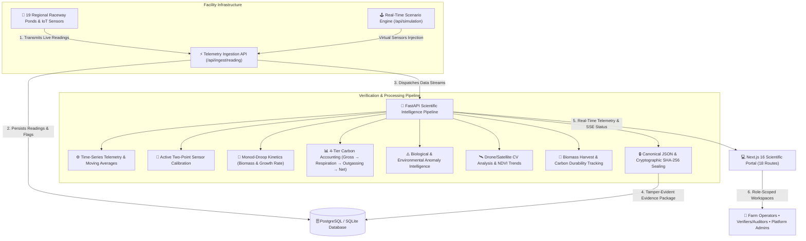

# AlgaX — Carbon Intelligence, MRV & Verification Platform
### Scientific Measurement, Reporting, and Verification (MRV) Infrastructure for Microalgae Bio-Sequestration

AlgaX is a production-grade, real-time carbon intelligence and verification platform engineered specifically for industrial microalgae carbon sequestration facilities. Built in strict accordance with international **MRV (Measurement, Reporting, and Verification)** carbon standards, AlgaX fuses high-frequency IoT sensor telemetry, biological Monod-Droop photosynthetic kinetics, multi-factor anomaly intelligence, aerial remote sensing cross-validation, active sensor calibration workspaces, and SHA-256 cryptographic evidence sealing.

---

## 🔬 Core Product Philosophy: Data → Science → Verification → Evidence

Rather than treating features as disjoint SaaS dashboard widgets, AlgaX structures all operations around a rigorous **Scientific MRV Verification Pipeline**:

```
┌─────────────────┐       ┌─────────────────┐       ┌─────────────────┐       ┌─────────────────┐
│   OPERATIONS    │  ──►  │     SCIENCE     │  ──►  │  VERIFICATION  │  ──►  │    EVIDENCE     │
│                 │       │                 │       │                 │       │                 │
│ • Live IoT Data │       │ • Monod-Droop   │       │ • Cross-Check   │       │ • SHA-256 Seal  │
│ • Ponds & Farms │       │ • Net Carbon    │       │ • Anomaly Flags │       │ • Merkle Proof  │
│ • Calibration   │       │ • Remote NDVI   │       │ • Audit Queue   │       │ • Certified PDF │
└─────────────────┘       └─────────────────┘       └─────────────────┘       └─────────────────┘
```

### Precision Data State Categorization
AlgaX maintains strict, visual and logical state distinctions throughout the interface and audit trails:
- 🟢 **Live / Ingested:** Raw, calibrated telemetry streamed directly from optical, pH, DO, and thermal sensors.
- 🔵 **Calculated / Modeled:** Biokinetic dry biomass accumulation and 4-tier carbon deductions derived from biological equations.
- 🟣 **Verified / Sealed:** Cryptographically hashed evidence packages approved by accredited third-party verifiers.
- 🔴 **Flagged / Anomaly:** Sensor dropouts, biological crash risks, thermal stress, or outgassing divergence requiring audit review.

---

## 🖥️ Platform Navigation & Workflow Hierarchy

The platform navigation reflects operational and scientific reality, organized into 5 structured domains:

```text
ALGAX — Carbon Intelligence & MRV

OVERVIEW
  ● Carbon Intelligence & Pipeline Overview

OPERATIONS
  ├── Farms & Facilities (6 Regional Cultivation Units)
  ├── Cultivation Ponds (19 Distinct Microclimate Ponds)
  ├── Live Telemetry Ingestion (Moving Averages & Waveforms)
  └── Sensor Calibration Workspace (2-Point Linear Regression)

SCIENCE
  ├── Biokinetic Growth Engine (Monod-Droop Dynamics)
  ├── Carbon Sequestration Engine (4-Tier Accounting Waterfall)
  ├── Anomaly Intelligence (Root-Cause Explanations & Priority Scores)
  └── Remote Sensing & Computer Vision (NDVI & Orthomosaics)

VERIFICATION
  ├── Evidence Packages (Multi-Modal MRV Bundles)
  ├── Verifier Audit Queue (Auditor Decisions & Findings)
  └── Audit Certificates (Downloadable Certified PDF Artifacts)

SYSTEM & GOVERNANCE
  ├── Role-Based Access Control (RBAC: Operators, Auditors, Admins)
  ├── Simulation Scenario Engine (Virtual Faults & Kinetics)
  └── System Diagnostics & Hardware Inventory
```


---

## 🏗️ System Architecture



---

## 🧬 Scientific & Mathematical Foundations

### 1. Monod-Droop Photosynthetic Kinetics
The biokinetic growth engine calculates daily microalgae biomass accumulation $X(t)$ governed by internal nutrient quota $Q$, temperature response $f(T)$, and photon flux $f(I)$:

$$\mu(Q) = \mu_{\max} \cdot \left(1 - \frac{Q_{\min}}{Q}\right) \cdot f(T) \cdot f(I)$$

$$\frac{dX}{dt} = (\mu(Q) - D - m) \cdot X$$

*Where:*
- $\mu_{\max}$: Maximum specific growth rate ($\text{day}^{-1}$)
- $Q_{\min}$: Minimum subsistence nutrient quota ($\text{mg N / g biomass}$)
- $f(T) = \exp\left(-\beta (T - T_{\text{opt}})^2\right)$: Gaussian thermal kinetic envelope
- $D, m$: Dilution rate and biological mortality coefficient

### 2. 4-Tier Carbon Accounting Waterfall
Net sequestered atmospheric carbon ($\text{tCO}_2\text{e}$) is rigorously computed through four auditable deduction stages:

```text
┌──────────────────────────────────────────────────────────┐
│ Tier 1: Gross Photosynthetic Fixation                    │
│ C_gross = Biomass_Harvested (kg) × Carbon_Fraction (48%) │
└────────────────────────────┬─────────────────────────────┘
                             ▼
┌──────────────────────────────────────────────────────────┐
│ Tier 2: Dark Respiration Loss Subtraction                │
│ C_resp = ∫ R_dark(T) × Biomass(t) dt                     │
└────────────────────────────┬─────────────────────────────┘
                             ▼
┌──────────────────────────────────────────────────────────┐
│ Tier 3: Aqueous CO₂ Outgassing Loss Subtraction          │
│ C_outgas = k_L × A_pond × ( [CO₂_aq] - [CO₂_sat] )       │
└────────────────────────────┬─────────────────────────────┘
                             ▼
┌──────────────────────────────────────────────────────────┐
│ Tier 4: Certified Net Carbon Sequestration               │
│ Net_tCO₂e = (C_gross - C_resp - C_outgas) × (44 / 12)    │
└──────────────────────────────────────────────────────────┘
```

### 3. Active Two-Point Sensor Calibration
Ensures telemetry fidelity across optical density, pH, and dissolved oxygen probes before ingestion:

$$V_{\text{calibrated}} = \text{Gain} \times V_{\text{raw}} + \text{Offset}$$

$$\text{Gain} = \frac{Y_2 - Y_1}{X_2 - X_1}, \quad \text{Offset} = Y_1 - \text{Gain} \times X_1$$

---

## 🔒 Cryptographic Evidence Sealing & MRV Verification Chain

Every verifiable reporting period packages telemetry traces, model logs, CV aerial surveys, and calibration states into a canonical JSON payload sealed with **SHA-256 cryptographic hashes**:

```text
EVIDENCE PACKAGE SPECIFICATION (ALGAX-EP-2026)
─────────────────────────────────────────────────────────────────
[✓] Telemetry Integrity Checked (100% Valid Samples)
[✓] Sensor Calibration Offset & Gain Applied
[✓] Monod-Droop Growth Model Re-simulated & Reconciled
[✓] 4-Tier Carbon Accounting Waterfall Derived
[✓] Multispectral NDVI Aerial Density Cross-Validated
[✓] Environmental & Biological Anomaly Logs Cleared/Resolved
[✓] Canonical Deterministic JSON Payload Generated
[✓] SHA-256 Hash Generated: 8f7c3b91e240...a91d72cf01b4

VERIFIER WORKFLOW & AUDITOR DECISIONS:
  [ APPROVE EVIDENCE ]  •  [ REQUEST INFORMATION (RFI) ]  •  [ REJECT BATCH ]
```

---

## 📍 Multi-Facility Topology (6 Regional Facilities, 19 Ponds)

AlgaX models **6 distinct Indian cultivation facilities** spanning 5 states and microclimates, comprising **19 distinct, independent raceway ponds and photobioreactors** with dedicated telemetry hardware and unique regional photography:

| Facility Name | Location & Coordinates | Climate Profile | Ponds Count | Regional Ponds & Strains |
| :--- | :--- | :--- | :---: | :--- |
| **Kutch Bio-Raceway Facility** | Kutch, Gujarat<br>`(23.733° N, 69.859° E)` | Arid Coastal Basin<br>345+ sunny days/yr | **4** | • **Pond Narmada** (*Chlorella vulgaris*)<br>• **Pond Sabarmati** (*Spirulina platensis*)<br>• **Pond Tapi** (*Scenedesmus obliquus*)<br>• **Pond Mahi** (*Dunaliella salina*) |
| **Rameswaram Coastal Algae Hub** | Rameswaram, Tamil Nadu<br>`(9.287° N, 79.312° E)` | Tropical Marine Basin<br>Year-round coastal warmth | **3** | • **Pond Kaveri** (*Chlorella vulgaris*)<br>• **Pond Vaigai** (*Spirulina platensis*)<br>• **Pond Tamirabarani** (*Haematococcus pluvialis*) |
| **Sambhar Salt Lake Site** | Sambhar Lake, Rajasthan<br>`(26.901° N, 75.006° E)` | Semi-Arid Salt Playa<br>Extreme solar irradiance | **3** | • **Pond Luni** (*Dunaliella salina*)<br>• **Pond Pushkar** (*Spirulina platensis*)<br>• **Pond Banas** (*Chlorella pyrenoidosa*) |
| **Kochi Blue-Carbon Facility** | Kochi, Kerala<br>`(9.931° N, 76.267° E)` | Tropical Coastal Monsoon<br>Brackish estuarine mixed feed | **3** | • **Pond Periyar** (*Nannochloropsis oculata*)<br>• **Pond Pamba** (*Tetraselmis suecica*)<br>• **Pond Chalakudy** (*Isochrysis galbana*) |
| **Chilika Lagoon Hub** | Chilika, Odisha<br>`(19.716° N, 85.321° E)` | Coastal Brackish Wetland<br>Ramsar ecological corridor | **3** | • **Pond Mahanadi** (*Chlorella vulgaris*)<br>• **Pond Daya** (*Scenedesmus obliquus*)<br>• **Pond Bhargavi** (*Spirulina maxima*) |
| **Bhavnagar Marine Algae Centre** | Bhavnagar, Gujarat<br>`(21.764° N, 72.151° E)` | Gulf of Khambhat Marine<br>Filtered tidal seawater intake | **3** | • **Pond Shetrunji** (*Chlorella vulgaris*)<br>• **Pond Dhadhar** (*Spirulina platensis*)<br>• **Pond Ghela** (*Dunaliella salina*) |

---

## 👥 Role-Based Access Control (RBAC)

AlgaX enforces strict, backend-guarded access control across three primary enterprise roles:

### 1. Farm Operator (`FARM_OPERATOR`)
- **Scope:** Scoped strictly to assigned cultivation facilities and raceway ponds.
- **Capabilities:** Monitor real-time sensor telemetry, trigger Monod-Droop model estimations, log sensor calibration records, record biomass harvest events, investigate biological/environmental anomalies, execute scenario simulations, and prepare evidence packages.
- **Boundaries:** Cannot access unauthorized facilities, cannot alter global system settings, and cannot issue official verifier audit decisions.

### 2. Verifier / Auditor (`VERIFIER_AUDITOR`)
- **Scope:** Access to audit trails, multi-modal evidence packages, cross-validation metrics, and provenance records for authorized facilities.
- **Capabilities:** Inspect sealed evidence packages, verify SHA-256 cryptographic hashes against canonical JSON payloads, evaluate carbon deduction waterfalls, audit NDVI remote sensing consistency, log review actions, and export certified PDF audit reports.
- **Boundaries:** Cannot modify raw sensor telemetry, cannot alter scientific parameters, and cannot administer platform user accounts.

### 3. Platform Admin (`PLATFORM_ADMIN`)
- **Scope:** Unrestricted platform-wide supervision and administrative management.
- **Capabilities:** Provision, update, and deactivate user accounts; assign roles; configure farm and pond associations; manage multi-facility deployments; inspect platform-wide audit logs and health telemetry.

---

## 🛠️ Technology Stack & Engineering Standards

| Layer | Technologies & Libraries |
| :--- | :--- |
| **Frontend Portal** | React 19 • Next.js 16 (Turbopack, App Router) • TypeScript • Tailwind CSS • Lucide Icons • Recharts |
| **Backend API** | Python 3.10+ • FastAPI (Lifespan Context Manager) • Pydantic V2 (`ConfigDict`) • Uvicorn |
| **Database & ORM** | PostgreSQL / SQLite3 • SQLAlchemy 2.0 • Alembic Migrations |
| **Scientific & Analytics** | NumPy • SciPy (ODE Integration & Kinetic Fits) • ReportLab (Audit PDFs) • hashlib (SHA-256) |
| **Testing & Quality** | Pytest (141 unit & integration tests) • FastAPI TestClient • Strict Isolation Verification Suite |

---

## 🚀 Quick Start & Local Development

### Prerequisites
- Python 3.10+
- Node.js 18+ and npm
- Git

### 1. Repository Setup
```bash
# Clone the repository
git clone https://github.com/VekariaDharmesh/AlgaX.git
cd AlgaX
```

### 2. Backend Setup
```bash
cd backend

# Create and activate virtual environment
python3 -m venv venv
source venv/bin/activate  # On Windows: venv\Scripts\activate

# Install dependencies
pip install -r requirements.txt

# Seed database with 6 facilities, 19 ponds & telemetry
python seed.py

# Start backend server
uvicorn app.main:app --reload --host 0.0.0.0 --port 8000
```
*Backend API available at: `http://localhost:8000` (Swagger UI interactive docs at `http://localhost:8000/docs`)*

### 3. Frontend Setup
```bash
cd frontend

# Install Node dependencies
npm install

# Start Next.js development server
npm run dev
```
*Web application available at: `http://localhost:3000`*

### 4. Running Backend Verification Tests
```bash
cd backend
source venv/bin/activate

# Run full backend test suite (141 tests with 0 warnings)
pytest

# Run complete 11-flow end-to-end operational verification
PYTHONPATH=. python tests/verify_all_flows.py
```

### 5. Frontend Production Build Check
```bash
cd frontend
npm run build
```

---

## 📡 API Endpoints Reference

### 🔐 Authentication & Users
- `GET /health` — Platform health check
- `GET /api/auth/me` — Authenticated profile & permitted role transitions
- `GET /api/users` — List platform users
- `POST /api/users` — Provision new platform user

### 🏭 Facilities & Cultivation Ponds
- `GET /api/farms` — List all 6 cultivation facilities
- `GET /api/farms/{farm_id}` — Get facility details and pond roster
- `GET /api/ponds` — List ponds (scoped by `farm_id`)
- `GET /api/ponds/{pond_id}` — Get single pond configuration & sensors
- `POST /api/ponds` — Create new pond record
- `PUT /api/ponds/{pond_id}` — Update pond metadata
- `DELETE /api/ponds/{pond_id}` — Remove pond with associated sensor cascades

### 📊 Real-Time Telemetry & Sensors
- `POST /api/ingest/reading` — Ingest high-frequency sensor reading
- `GET /api/telemetry` — Retrieve time-series telemetry streams
- `GET /api/telemetry/stats` — Summary telemetry statistics (min, max, mean, std)
- `GET /api/sensors` — List sensor hardware inventory

### 🔧 Sensor Calibration Workspace
- `POST /api/calibrations/calculate` — Compute zero-point & two-point calibration equations
- `POST /api/calibrations` — Log calibration record
- `GET /api/calibrations` — List historical calibration records
- `POST /api/calibrations/{id}/activate` — Activate calibration gain/offset adjustment
- `GET /api/sensors/calibration-status` — Calibration drift monitoring and due dates

### 🕹️ Simulation Scenario Engine
- `POST /api/simulation/scenario` — Inject scenarios (`healthy`, `nutrient_depletion`, `heatwave`, `sensor_dropout`)
- `GET /api/simulation/status` — Current virtual pond status, speed multiplier, and state
- `POST /api/simulation/control` — Playback controls (`set_speed`, `pause`, `resume`, `step`)
- `POST /api/simulation/reset` — Reset virtual pond simulation state

### 🦠 Modeling & Carbon Accounting
- `POST /api/model/run` — Execute Monod-Droop growth model for a time window
- `GET /api/model/biomass` — Retrieve dry biomass estimates
- `GET /api/model/carbon` — Retrieve 4-tier net carbon sequestration estimates

### ⚠️ Anomaly Intelligence
- `GET /api/anomalies` — List active anomaly flags with priority scores
- `GET /api/anomalies/{id}` — Get anomaly details and explanation record
- `GET /api/anomalies/{id}/explanation` — Retrieve mechanistic root-cause explanation
- `PATCH /api/anomalies/{id}/status` — Update review status (`ACKNOWLEDGED`, `INVESTIGATING`, `RESOLVED`)

### 🛰️ Imagery & Remote Sensing
- `POST /api/imagery` — Upload aerial raster capture
- `GET /api/imagery` — List imagery captures
- `POST /api/imagery/{id}/process` — Compute NDVI vegetation indices
- `POST /api/imagery/{id}/analyze` — Run CV feature and density classification
- `GET /api/ponds/{id}/imagery/analysis` — Time-series imagery trends

### 🔒 Evidence Packages & Verification
- `POST /api/ponds/{id}/evidence-packages` — Assemble multi-modal MRV package
- `GET /api/evidence-packages/{id}` — Retrieve evidence package details
- `POST /api/evidence-packages/{id}/seal` — Cryptographically seal package with SHA-256 hash
- `GET /api/evidence-packages/{id}/verify` — Verify package integrity against canonical hash
- `GET /api/evidence-packages/{id}/pdf` — Generate downloadable certified PDF audit certificate
- `POST /api/evidence-packages/{id}/review/actions` — Record verifier audit action

### 🌾 Harvest & Carbon Durability
- `GET /api/harvests/overview` — Harvest statistics & KPIs
- `GET /api/ponds/{id}/readiness` — Biomass harvest readiness evaluation
- `POST /api/harvests` — Log batch harvest event
- `POST /api/harvests/{id}/fate` — Allocate biomass fate (Biochar, Bioplastics, Soil, Fuel)

### 🌤️ Weather Intelligence
- `GET /api/weather/current` — Current temperature, solar irradiance, and weather conditions
- `GET /api/weather/search` — Geographic coordinate lookup and forecasts

---

## 📄 License & Compliance

AlgaX is developed under enterprise carbon MRV standards for microalgae bio-sequestration. All rights reserved.
