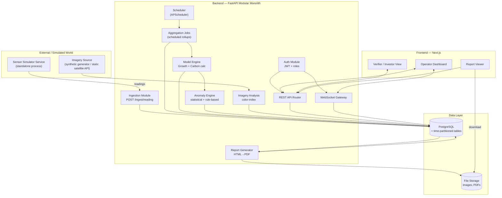
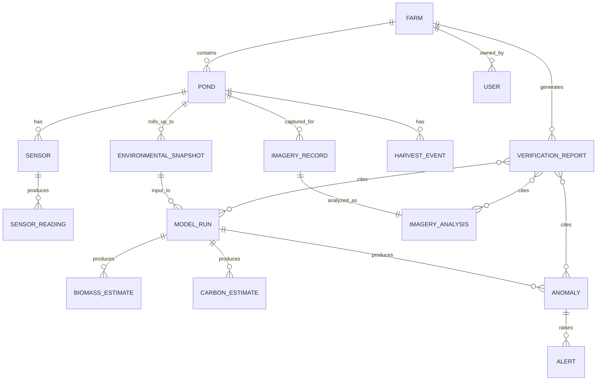
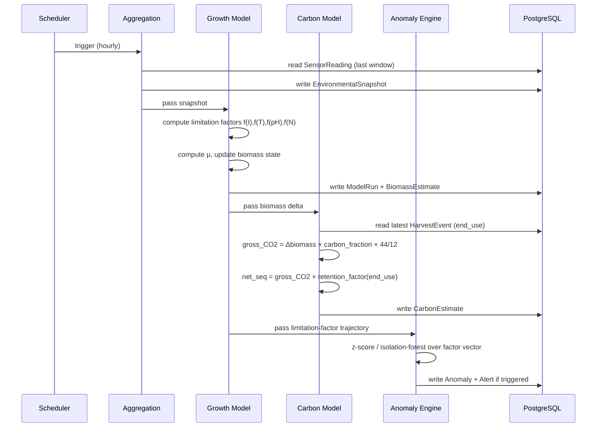
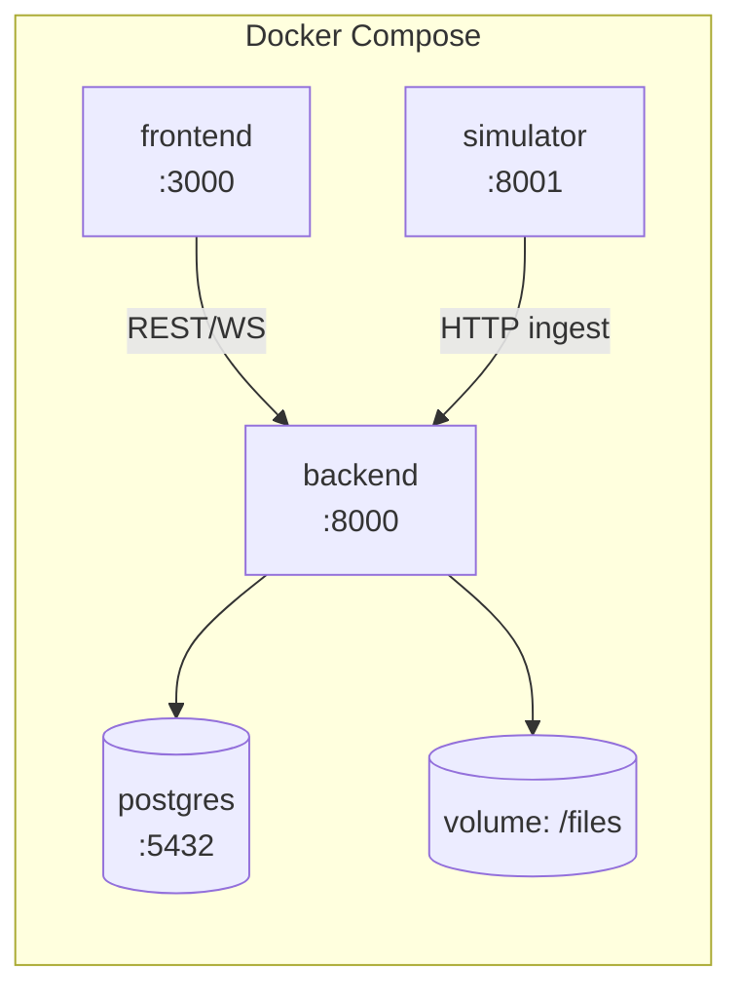

# architecture.md — AlgaX Technical Architecture
### Companion to `plan.md` · Implementation-Level System Design

This document is the detailed technical architecture for the platform described in `plan.md`. Where `plan.md` explains *what* and *why*, this document specifies *how*: components, data contracts, schemas, APIs, and deployment topology, at a level another developer or coding agent can build directly from.

---

## 1. Architecture Overview

The system is a **modular monolith** backend (FastAPI) with one deliberately-separated external process (the sensor simulator), a React/Next.js frontend, and a PostgreSQL database. Every derived value in the system traces back through a chain: `SensorReading → EnvironmentalSnapshot → ModelRun → {BiomassEstimate, CarbonEstimate, Anomaly} → VerificationReport`. This traceability chain is the architectural backbone — every other design decision serves it.



---

## 2. Component Responsibilities

| Component | Responsibility | Talks to |
|---|---|---|
| **Sensor Simulator** | Runs the driven dynamical model (diurnal/weather driver → growth model → derived sensor values + noise/outliers/dropouts); posts readings to the ingestion endpoint on a schedule; exposes a demo-control endpoint to inject scripted scenario events | Ingestion Module only, via HTTP — architected exactly as a real device would talk to the system |
| **Ingestion Module** | Validates and persists incoming readings; assigns `quality_flag`; agnostic to whether the sender is simulated or real hardware | PostgreSQL |
| **Aggregation Jobs** | Rolls raw `SensorReading` rows into time-windowed `EnvironmentalSnapshot` rows per pond, on a fixed schedule | PostgreSQL, triggers Model Engine |
| **Model Engine** | Runs the growth model and carbon calculation (plan.md §7, §12) against snapshots; writes versioned `ModelRun` + `BiomassEstimate` + `CarbonEstimate` rows | PostgreSQL, triggers Anomaly Engine |
| **Anomaly Engine** | Detects sensor-level and environmental anomalies (plan.md §15); computes root-cause explanation from growth-model limitation terms; writes `Anomaly` + `Alert` | PostgreSQL |
| **Imagery Analysis** | Computes greenness index from imagery; compares against model biomass estimate; writes `ImageryAnalysis`, flags discrepancies | PostgreSQL |
| **Report Generator** | Assembles evidence bundle for a period, renders HTML template, exports PDF + JSON, writes `VerificationReport` | PostgreSQL, File Storage |
| **Auth Module** | JWT issuance/validation, role-based access control | PostgreSQL (`User` table) |
| **REST API Router** | CRUD/query endpoints consumed by the frontend | All modules |
| **WebSocket Gateway** | Pushes live sensor updates and new alerts to connected dashboard clients, scoped by pond/farm subscription | PostgreSQL (via pub/sub on write), Auth |
| **Scheduler** | Triggers Aggregation → Model Engine → Anomaly Engine pass at a fixed interval (simulated-hourly) | Internal |

---

## 3. Technology Stack

| Layer | Technology | Version guidance |
|---|---|---|
| Backend framework | FastAPI | Python 3.11+ |
| ORM / migrations | SQLAlchemy 2.x + Alembic | — |
| Numerical/model code | numpy, pandas | — |
| ML (anomaly/forecast) | scikit-learn, statsmodels | — |
| Imagery | Pillow, OpenCV (opencv-python-headless) | — |
| Scheduling | APScheduler (in-process) | acceptable at hackathon scale; swap for Celery+Redis if moved to production |
| PDF rendering | WeasyPrint (HTML/CSS → PDF) | — |
| Database | PostgreSQL 15+ | TimescaleDB extension optional (see §5.4) |
| Auth | python-jose (JWT), passlib (hashing) | — |
| Realtime | native FastAPI WebSocket | — |
| Frontend framework | Next.js 14 (React 18) | App Router |
| Data fetching | React Query (TanStack Query) | — |
| Charts | Recharts | — |
| Styling | Tailwind CSS | — |
| Containerization | Docker + Docker Compose | — |

---

## 4. Repository / Folder Structure

```
algax/
├── backend/
│   ├── app/
│   │   ├── main.py                 # FastAPI app entrypoint, router mounting
│   │   ├── config.py                # settings (env-driven)
│   │   ├── db/
│   │   │   ├── session.py
│   │   │   └── models/              # SQLAlchemy models, one file per entity group
│   │   │       ├── farm_pond.py
│   │   │       ├── sensor.py
│   │   │       ├── estimates.py
│   │   │       ├── anomaly.py
│   │   │       ├── imagery.py
│   │   │       ├── report.py
│   │   │       └── user.py
│   │   ├── schemas/                 # Pydantic request/response models
│   │   ├── api/
│   │   │   ├── routes_ingest.py
│   │   │   ├── routes_farms.py
│   │   │   ├── routes_ponds.py
│   │   │   ├── routes_anomalies.py
│   │   │   ├── routes_reports.py
│   │   │   ├── routes_auth.py
│   │   │   └── ws.py
│   │   ├── modules/
│   │   │   ├── aggregation/
│   │   │   ├── model_engine/
│   │   │   │   ├── growth_model.py
│   │   │   │   ├── carbon_model.py
│   │   │   │   └── versioning.py
│   │   │   ├── anomaly_engine/
│   │   │   │   ├── sensor_level.py
│   │   │   │   ├── environmental.py
│   │   │   │   └── explain.py
│   │   │   ├── imagery/
│   │   │   └── reporting/
│   │   │       ├── evidence_bundle.py
│   │   │       └── templates/report.html
│   │   ├── scheduler.py
│   │   └── auth/
│   ├── alembic/
│   ├── tests/
│   │   ├── unit/
│   │   ├── integration/
│   │   └── fixtures/
│   ├── requirements.txt
│   └── Dockerfile
├── simulator/
│   ├── driver.py                    # diurnal/weather driver
│   ├── growth.py                    # shared growth-model reference (mirrors model_engine)
│   ├── sensors.py                   # sensor derivation + noise/outlier/dropout
│   ├── scenarios.py                 # scripted event definitions
│   ├── publisher.py                 # posts to ingestion API
│   ├── control_api.py               # demo-control endpoint
│   └── Dockerfile
├── frontend/
│   ├── app/
│   │   ├── farms/[farmId]/page.tsx
│   │   ├── ponds/[pondId]/page.tsx
│   │   ├── ponds/[pondId]/anomalies/page.tsx
│   │   ├── reports/[reportId]/page.tsx
│   │   └── login/page.tsx
│   ├── components/
│   │   ├── charts/
│   │   ├── dashboard/
│   │   └── report/
│   ├── lib/
│   │   ├── api.ts
│   │   └── ws.ts
│   └── Dockerfile
├── docker-compose.yml
├── plan.md
└── architecture.md
```

---

## 5. Data Architecture (Full Schema)

### 5.1 Entity-Relationship Diagram



### 5.2 Table Definitions

**farm**
| Column | Type | Notes |
|---|---|---|
| id | UUID PK | |
| name | text | |
| location | text | free-form or lat/lng pair |
| owner_user_id | UUID FK → user.id | |
| created_at | timestamptz | |

**pond**
| Column | Type | Notes |
|---|---|---|
| id | UUID PK | |
| farm_id | UUID FK → farm.id | |
| name | text | |
| volume_liters | numeric | used for plausibility bounds (§22 of plan.md) |
| species | text | algae strain identifier, drives model constants (μmax, carbon fraction) |
| status | enum(active, harvested, offline) | |
| created_at | timestamptz | |

**sensor**
| Column | Type | Notes |
|---|---|---|
| id | UUID PK | |
| pond_id | UUID FK | |
| type | enum(temperature, ph, dissolved_oxygen, turbidity, light, conductivity, water_level) | |
| unit | text | e.g. °C, mg/L, NTU, µmol/m²/s |
| is_simulated | boolean | non-nullable — the real/simulated switch (plan.md §10.4) |
| calibration_metadata | jsonb | nullable, e.g. turbidity→biomass calibration curve params |

**sensor_reading** *(time-partitioned)*
| Column | Type | Notes |
|---|---|---|
| id | UUID PK | |
| sensor_id | UUID FK | |
| pond_id | UUID | denormalized for partition/query efficiency |
| timestamp | timestamptz | partition key |
| value | numeric | |
| quality_flag | enum(ok, outlier, missing, interpolated) | non-nullable |
| source_type | enum(measured, simulated) | non-nullable |

Index: `(pond_id, sensor_id, timestamp DESC)`.

**environmental_snapshot**
| Column | Type | Notes |
|---|---|---|
| id | UUID PK | |
| pond_id | UUID FK | |
| window_start | timestamptz | |
| window_end | timestamptz | |
| agg_values | jsonb | `{sensor_type: {mean, min, max, count, missing_count}}` |
| completeness_ratio | numeric | share of expected readings present & unflagged |

**model_run**
| Column | Type | Notes |
|---|---|---|
| id | UUID PK | |
| model_type | enum(growth, carbon, anomaly, forecast) | |
| model_version | text | semantic version string, e.g. `growth-v1.2` |
| pond_id | UUID FK | |
| input_snapshot_id | UUID FK → environmental_snapshot.id | reproducibility anchor |
| parameters | jsonb | model constants used (μmax, carbon_fraction, etc.) at run time |
| created_at | timestamptz | |

**biomass_estimate**
| Column | Type | Notes |
|---|---|---|
| id | UUID PK | |
| pond_id | UUID FK | |
| model_run_id | UUID FK → model_run.id | |
| timestamp | timestamptz | |
| biomass_g_per_l | numeric | |
| method | enum(turbidity_calibration, growth_model) | |
| source_type | enum(estimated, modeled) | non-nullable |
| confidence_score | numeric(0–1) | non-nullable |

**carbon_estimate**
| Column | Type | Notes |
|---|---|---|
| id | UUID PK | |
| pond_id | UUID FK | |
| model_run_id | UUID FK | |
| period_start / period_end | timestamptz | |
| gross_co2_fixed_kg | numeric | ≥ 0 (enforced, §27 of plan.md) |
| net_sequestration_kg | numeric, nullable | null when end-use undeclared; ≤ gross when present |
| end_use_assumption | enum(biofuel, food_feed, bioplastic, durable_storage, unspecified) | |
| retention_factor_used | numeric | value of the factor applied, stored for auditability |
| source_type | enum(modeled) | |
| confidence_score | numeric(0–1) | |

**imagery_record**
| Column | Type | Notes |
|---|---|---|
| id | UUID PK | |
| pond_id | UUID FK | |
| timestamp | timestamptz | |
| image_url | text | points into File Storage |
| source | enum(simulated, drone, satellite) | |
| capture_metadata | jsonb | |

**imagery_analysis**
| Column | Type | Notes |
|---|---|---|
| id | UUID PK | |
| imagery_record_id | UUID FK | |
| greenness_index | numeric | |
| estimated_coverage_pct | numeric | |
| correlated_biomass_g_per_l | numeric | derived from index via calibration |
| agreement_with_model | numeric | signed delta vs. concurrent `BiomassEstimate` |
| confidence_score | numeric(0–1) | |

**anomaly**
| Column | Type | Notes |
|---|---|---|
| id | UUID PK | |
| pond_id | UUID FK | |
| model_run_id | UUID FK, nullable | present for environmental anomalies, null for pure sensor-level ones |
| detected_at | timestamptz | |
| type | enum(sensor_outlier, sensor_dropout, growth_deviation, culture_crash_pattern, imagery_sensor_discrepancy) | |
| severity | enum(low, medium, high) | |
| explanation | jsonb | `{contributing_factors: [...], deltas: {...}, narrative: text}` |
| status | enum(open, acknowledged, resolved) | |

**alert**
| Column | Type | Notes |
|---|---|---|
| id | UUID PK | |
| anomaly_id | UUID FK | |
| message | text | |
| recommended_action | text | |
| sent_at | timestamptz | |

**harvest_event**
| Column | Type | Notes |
|---|---|---|
| id | UUID PK | |
| pond_id | UUID FK | |
| timestamp | timestamptz | |
| biomass_harvested_kg | numeric | validated against volume-based plausibility bound |
| declared_end_use | enum(biofuel, food_feed, bioplastic, durable_storage, unspecified) | |

**verification_report**
| Column | Type | Notes |
|---|---|---|
| id | UUID PK | |
| farm_id | UUID FK | |
| pond_ids | UUID[] | |
| period_start / period_end | timestamptz | |
| generated_at | timestamptz | |
| pdf_url | text | |
| json_payload | jsonb | full evidence bundle |
| model_run_ids | UUID[] | evidence linkage |
| anomaly_ids | UUID[] | evidence linkage |
| imagery_analysis_ids | UUID[] | evidence linkage |
| disclaimer_text | text | hard-coded non-claim statement (plan.md §16) |

**user**
| Column | Type | Notes |
|---|---|---|
| id | UUID PK | |
| name / email | text | |
| password_hash | text | |
| role | enum(operator, verifier, investor, admin) | |
| farm_id | UUID FK, nullable | scoping for non-admin roles |

### 5.3 Provenance Invariants (enforced, not optional)

- `source_type` and `confidence_score` are `NOT NULL` on every derived table (`biomass_estimate`, `carbon_estimate`, `imagery_analysis`).
- `carbon_estimate.net_sequestration_kg` is `NULL` (never `0`) when `end_use_assumption = unspecified` — a DB-level CHECK constraint plus application-level validation both enforce this, since it's a meaningful honesty distinction (plan.md §27).
- `model_run_id` foreign keys are `NOT NULL` on every estimate table — no derived number may exist without a versioned run that produced it.

### 5.4 Time-series storage approach

Default: native PostgreSQL **range partitioning** on `sensor_reading.timestamp` (e.g., daily partitions), which needs no extra extension and is sufficient at hackathon data volumes (a few ponds × 5-minute intervals × a multi-day demo run is a small dataset). If the deployment environment has the **TimescaleDB** extension available, convert `sensor_reading` to a hypertable for better compression and continuous-aggregate support — this is a drop-in upgrade, not a schema redesign, since the table shape is unchanged either way.

---

## 6. API Design

### 6.1 Authentication

- `POST /api/auth/login` → `{email, password}` → `{access_token, role, farm_id}`
- All other routes require `Authorization: Bearer <JWT>`.
- Role enforcement: `operator` scoped to own `farm_id`; `verifier`/`investor` scoped to farms/reports explicitly shared with them; `admin` unscoped.

### 6.2 Ingestion

`POST /api/ingest/reading`
```json
// request
{
  "sensor_id": "uuid",
  "timestamp": "2026-09-12T10:05:00Z",
  "value": 24.3,
  "source_type": "simulated"
}
// response 201
{ "id": "uuid", "quality_flag": "ok" }
```
Validation: value range-checked per sensor type; malformed/impossible values rejected with `422`.

### 6.3 Farm & Pond Query

- `GET /api/farms/{farm_id}/overview` → aggregate biomass/carbon, pond list with status, active alert count.
- `GET /api/ponds/{pond_id}/timeseries?sensor=temperature&from=&to=` → raw/aggregated readings for charting.
- `GET /api/ponds/{pond_id}/biomass?from=&to=` → `BiomassEstimate` series with `confidence_score`, `method`.
- `GET /api/ponds/{pond_id}/carbon?from=&to=` → `CarbonEstimate` series, both gross and net (nullable) fields explicit.
- `GET /api/ponds/{pond_id}/anomalies?status=open` → anomaly log with `explanation` payload.

### 6.4 Operator Actions

- `POST /api/ponds/{pond_id}/harvest` → `{biomass_harvested_kg, declared_end_use}` → creates `harvest_event`, feeds next `CarbonEstimate` run.
- `POST /api/anomalies/{id}/acknowledge` → sets `status=acknowledged`.

### 6.5 Reporting

`POST /api/reports/generate`
```json
// request
{ "farm_id": "uuid", "pond_ids": ["uuid"], "period_start": "...", "period_end": "..." }
// response 201
{ "report_id": "uuid", "status": "generated", "pdf_url": "/files/reports/uuid.pdf" }
```
`GET /api/reports/{id}` → full JSON payload (evidence bundle) + `pdf_url`.

### 6.6 Real-time

`WS /ws/ponds/{pond_id}` — on connect, client authenticates via token query param; server pushes:
```json
{ "type": "reading", "sensor_type": "ph", "value": 8.1, "timestamp": "..." }
{ "type": "alert", "anomaly_id": "uuid", "severity": "medium", "message": "..." }
```
Scoped per-pond subscription; the gateway fans out from a lightweight internal pub/sub keyed by `pond_id`, populated by the Ingestion and Anomaly modules on write (in-process event bus for the hackathon scale — no external broker needed).

### 6.7 Demo Control (simulator-facing, non-production)

`POST /api/demo/inject-scenario` → `{pond_id, scenario: "nutrient_depletion" | "heatwave" | "sensor_dropout"}` — forwarded to the simulator's control API; exists specifically to make the demo (plan.md §28) reliably triggerable rather than dependent on random chance.

---

## 7. Model Engine — Computational Architecture



Each model function is **pure**: `f(snapshot, parameters) → output`, versioned by a `model_version` string bumped whenever the function body changes. This makes `ModelRun.parameters` + `model_version` + `input_snapshot_id` sufficient to reproduce any historical estimate exactly — the core auditability property required for the verification-report use case (plan.md §16).

---

## 8. Anomaly Detection Architecture

Two independent detectors feeding one `Anomaly` table:

1. **Sensor-level detector** (`modules/anomaly_engine/sensor_level.py`): rolling z-score per sensor stream over a trailing window; flags single-point outliers and gap-based dropouts. Operates directly on `SensorReading`, runs on ingestion (cheap, real-time).
2. **Environmental detector** (`modules/anomaly_engine/environmental.py`): operates on the **limitation-factor vector** `[f(I), f(T), f(pH), f(N)]` output by the Growth Model at each `ModelRun`, using an Isolation Forest (unsupervised, no labels needed) trained incrementally on the pond's own recent history. Runs on the scheduled model-engine pass.
3. **Explain module** (`modules/anomaly_engine/explain.py`): given a triggered environmental anomaly, identifies which factor(s) deviated most from their trailing baseline and constructs the structured `explanation` payload (`contributing_factors`, `deltas`, human-readable `narrative`) — this is what ties the ML detection step back to a domain-grounded cause rather than a bare "anomaly score."

---

## 9. Frontend Architecture

- **Routing:** Next.js App Router, role-aware — `operator` sees full nav (farm/pond/anomaly/report + harvest action); `verifier`/`investor` see read-only farm/report views only.
- **Data layer:** React Query for all REST reads with cache invalidation on relevant mutations (e.g., harvest submission invalidates the pond's carbon-estimate query); a thin `useWebSocket(pondId)` hook layers live updates on top of the same cache (optimistic merge of incoming `reading`/`alert` events).
- **Component boundaries:**
  - `components/dashboard/FarmOverview` — pond grid, aggregate stats, alert banner.
  - `components/dashboard/PondDetail` — live sensor charts (Recharts `LineChart` per sensor type), current biomass/carbon cards with confidence indicator.
  - `components/dashboard/AnomalyPanel` — anomaly list + explanation drill-down + recommended action.
  - `components/report/ReportViewer` — evidence bundle rendering, matching the PDF layout so the in-app view and the exported document are visually consistent.
- **Confidence/provenance UI convention:** every headline number (biomass, gross CO₂, net sequestration) renders with a small confidence badge and a provenance tag (estimated/modeled/simulated) — implemented as one shared `<ValueWithProvenance>` component, not repeated ad hoc, so the honesty constraint from plan.md §21 is structurally consistent across the whole app rather than dependent on each screen remembering to add it.

---

## 10. Security Architecture

- **AuthN:** JWT (short-lived access token; refresh flow optional/out-of-scope for hackathon).
- **AuthZ:** role + farm-scoping middleware applied at the router level (a dependency injected into every protected route), not scattered per-handler checks — centralizes the "operator can only touch their own farm" rule in one place.
- **Data integrity:** operators cannot directly mutate `SensorReading`, `BiomassEstimate`, `CarbonEstimate`, or `Anomaly` rows via the API — these are write-only from internal modules. The only operator-writable domain action affecting these chains is `harvest_event` creation, which is itself logged and immutable once created.
- **Report immutability:** a generated `VerificationReport` is never edited in place; regenerating for the same period creates a new report row, preserving history.
- **Secrets:** DB credentials and JWT signing key via environment variables / Docker secrets, never hardcoded.

---

## 11. Deployment Architecture



`docker-compose.yml` defines four services (`frontend`, `backend`, `simulator`, `postgres`) plus a named volume for report/imagery file storage. `backend` runs Alembic migrations on startup before serving. `simulator` starts after `backend` is healthy (Compose `depends_on: condition: service_healthy`) and begins publishing readings immediately, so the system is fully live within seconds of `docker compose up`.

Environment-driven config (`.env`): DB URL, JWT secret, simulator publish interval, scheduler interval — all overridable without code changes, which also directly supports the real-IoT swap described in plan.md §10.4 (point `SENSOR_INGEST_URL` at the same backend from a real device instead of the simulator process).

---

## 12. Scalability & Evolution Notes

This architecture is intentionally sized for hackathon scope but built so the *scaling path* doesn't require redesign, only substitution:

| Current (hackathon) | Scales to (Phase 2+) | What changes |
|---|---|---|
| In-process scheduler (APScheduler) | Celery + Redis/RabbitMQ | Swap scheduler implementation; job function signatures unchanged |
| Simulator process | Real IoT devices / MQTT bridge | New publisher, same ingestion contract (§6.2) |
| Native Postgres partitioning | TimescaleDB hypertable | Same table shape, extension-level upgrade |
| In-process WebSocket pub/sub | Redis pub/sub for multi-instance fanout | Needed once backend runs as >1 replica |
| Local file storage volume | S3-compatible object storage | Swap storage backend behind the same `image_url`/`pdf_url` interface |
| Single-tenant demo auth | Full multi-tenant billing/roles | Additive on top of existing `role`/`farm_id` scoping, not a rework |

---

*This document should be kept in sync with `plan.md`. If an architectural decision changes during implementation, update both documents — `plan.md` for the rationale, this document for the resulting structure.*
